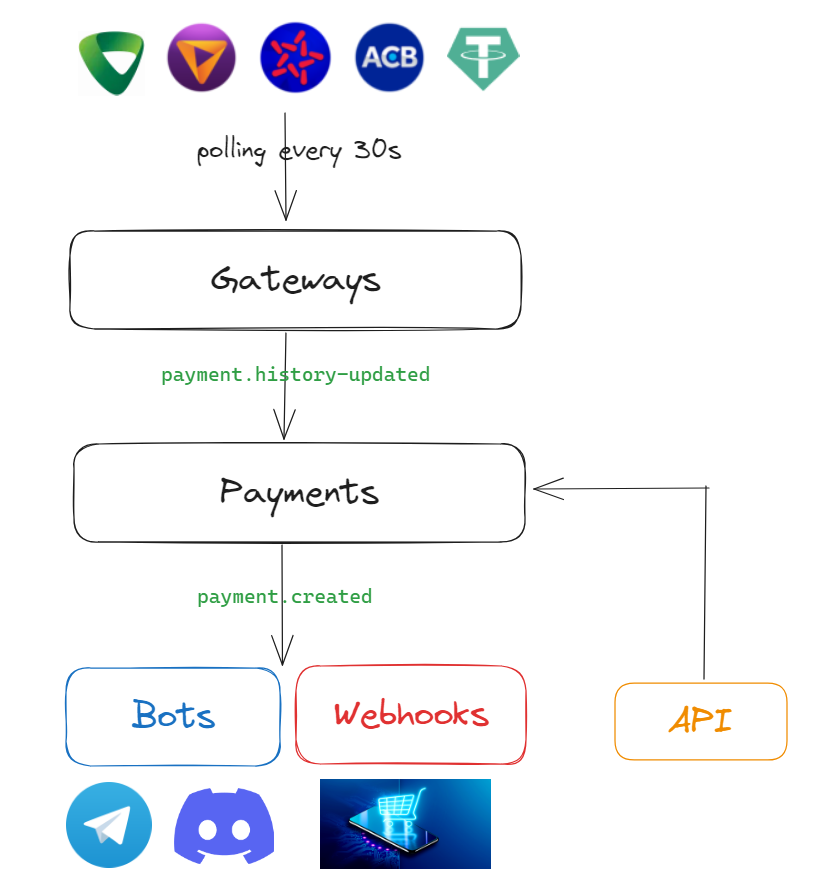

# Payment Gateway

Payment Gateway là dịch vụ NestJS tự host để đăng nhập ngân hàng, tạo mã
VietQR, đối chiếu giao dịch theo yêu cầu và phát sự kiện thanh toán sang
dashboard, webhook, Telegram hoặc Discord.

> Dự án sử dụng luồng web/API không chính thức của ngân hàng. Giao diện, cơ chế
> xác thực và endpoint phía ngân hàng có thể thay đổi bất kỳ lúc nào. Không nên
> coi đây là cổng thanh toán được ngân hàng bảo chứng.



## Tính năng

- Trang thanh toán VietQR tại `http://localhost:<PORT>`.
- Tạo nội dung chuyển khoản ngẫu nhiên dạng `PAY...`.
- Chỉ truy vấn lịch sử sau khi người dùng bấm **Tôi đã chuyển tiền**.
- Đối chiếu theo tài khoản nhận, số tiền, nội dung và thời điểm giao dịch.
- Đăng nhập sẵn các gateway khi khởi động nhưng chưa lấy lịch sử.
- Admin dashboard tại secret URL được sinh tự động.
- Thêm, sửa, bật hoặc tắt ACB, MB Bank, TPBank, Vietcombank và Techcombank từ dashboard.
- Xem trạng thái gateway và lịch sử giao dịch đã ghi nhận.
- API lấy giao dịch và API tạo/xác minh yêu cầu thanh toán.
- Gửi webhook và thông báo Telegram/Discord qua BullMQ.
- Lưu tối đa 500 giao dịch gần nhất trong bộ nhớ và Redis.
- Hỗ trợ proxy tĩnh hoặc proxy có URL đổi IP.
- Có thể bật lại chế độ polling tự động nếu cần.

## Gateway hỗ trợ

| Gateway     | Đăng nhập            | Lấy lịch sử  | Yêu cầu đặc biệt                      |
| ----------- | -------------------- | ------------ | ------------------------------------- |
| MB Bank     | Playwright + captcha | API          | Chromium và captcha resolver          |
| ACB         | Playwright + captcha | HTTP session | SafeKey khi xác thực thiết bị mới     |
| TPBank      | API                  | API          | `device_id` đã được xác thực          |
| Vietcombank | API mã hóa           | API mã hóa   | `device_id` và `user_agent` phải khớp |
| Techcombank | Playwright session   | API web      | Đăng nhập/duyệt mobile trong browser  |
| TRON USDT   | Không cần đăng nhập  | TronGrid     | Địa chỉ ví TRC20                      |
| BEP20 USDT  | API key              | Etherscan V2 | Địa chỉ ví và Etherscan API key       |

Admin dashboard chỉ quản lý năm gateway ngân hàng. Gateway USDT được cấu hình
trực tiếp trong `config/config.yml`.

Gateway USDT không xuất hiện trong danh sách tài khoản VietQR. Với implementation
hiện tại, cần bật `GATEWAY_AUTO_CRON=true` nếu muốn TRON/BEP20 tự lấy và phát
hiện giao dịch.

## Luồng hoạt động

### Chế độ đối chiếu theo yêu cầu

Đây là chế độ mặc định với `GATEWAY_AUTO_CRON=false`:

1. Service đăng nhập sẵn các gateway khi khởi động nếu
   `GATEWAY_PRELOGIN=true`.
2. Người dùng nhập số tiền và chọn tài khoản nhận.
3. Service tạo yêu cầu thanh toán, nội dung chuyển khoản và VietQR Quick Link.
4. Người dùng chuyển khoản rồi bấm **Tôi đã chuyển tiền**.
5. Service lấy lịch sử của đúng gateway được chọn.
6. Giao dịch thành công khi khớp:
   - Số tài khoản nhận.
   - Số tiền.
   - Nội dung chuyển khoản.
   - Thời gian không cũ hơn hai phút trước lúc tạo yêu cầu.
7. Giao dịch khớp được đưa vào PaymentService, sau đó có thể gửi webhook hoặc
   thông báo bot.

Mỗi yêu cầu tồn tại trong bộ nhớ 15 phút và sẽ mất khi service khởi động lại.
Số tiền hợp lệ từ `2.000` đến `9.999.999.999.999` VND.

### Chế độ polling tự động

Đặt `GATEWAY_AUTO_CRON=true` để mỗi gateway tự lấy lịch sử theo
`repeat_interval_in_sec`. Các giao dịch mới sẽ được lưu và chuyển tiếp sang bot,
webhook mà không cần thao tác trên trang thanh toán.

## Yêu cầu hệ thống

### Chạy local

- Node.js 20 trở lên.
- pnpm 9.
- Docker Desktop hoặc Docker Engine để chạy Redis và captcha resolver.
- Chromium do Playwright quản lý.

### Chạy bằng Docker

- Docker Engine hoặc Docker Desktop.
- Docker Compose.
- Terminal có thể attach nếu ACB cần nhập SafeKey.

## Cài đặt local

### 1. Cài pnpm

```bash
corepack enable
corepack prepare pnpm@9.15.9 --activate
hash -r
```

### 2. Cài dependency và Chromium

```bash
pnpm install
pnpm playwright install chromium
```

### 3. Tạo file cấu hình

```bash
cp .env.example .env
cp config/config.example.yml config/config.yml
```

Khi chạy app bằng `pnpm`, sửa các dòng sau trong `.env`:

```dotenv
PORT=3001
REDIS_HOST=localhost
REDIS_PORT=6380
CAPTCHA_API_BASE_URL=http://localhost:1234
GATEWAY_AUTO_CRON=false
GATEWAY_PRELOGIN=true
TECHCOMBANK_HEADLESS=false
PAYMENT_CHECK_TIMEOUT_SEC=30
PAYMENT_CHECK_INTERVAL_SEC=15
PAYMENT_CHECK_MAX_ATTEMPTS=2
DISABLE_SYNC_REDIS=true
```

### 4. Chạy Redis và captcha resolver

```bash
docker compose -f docker-compose.dev.yml up -d
```

Kiểm tra:

```bash
docker compose -f docker-compose.dev.yml ps
```

### 5. Cấu hình gateway

Sửa `config/config.yml`. Có thể bắt đầu với một ngân hàng để kiểm tra đăng nhập
trước khi bật nhiều gateway.

`config/config.example.yml` là mẫu tổng hợp, không phải cấu hình chạy ngay. Hãy:

- Đặt `bots: {}`, `webhooks: {}` và `proxies: {}` nếu chưa sử dụng.
- Xóa các gateway không dùng.
- Xóa field `proxy` khỏi gateway nếu không có proxy thật.
- Thay toàn bộ giá trị placeholder trước khi khởi động.

### 6. Chạy service

```bash
pnpm start
```

Chế độ tự reload:

```bash
pnpm start:dev
```

Mở trang thanh toán:

```text
http://localhost:3001
```

## Cài đặt bằng Docker

### 1. Tạo cấu hình

```bash
cp .env.example .env
cp config/config.example.yml config/config.yml
```

Rút gọn `config/config.yml` theo gateway thực tế trước khi chạy. Không giữ bot,
webhook hoặc proxy placeholder từ file mẫu.

Giữ cấu hình kết nối nội bộ Docker:

```dotenv
PORT=3001
REDIS_HOST=redis
REDIS_PORT=6379
CAPTCHA_API_BASE_URL=http://captcha-resolver:1234
```

### 2. Build và chạy

```bash
docker compose up --build
```

Chạy nền:

```bash
docker compose up -d --build
docker compose logs -f app
```

Các thư mục sau được mount để giữ dữ liệu qua lần tạo lại container:

- `config/config.yml`
- `.browser-data`
- `.admin-data`

Nếu ACB cần nhập SafeKey từ terminal, chạy foreground hoặc attach vào container:

```bash
docker attach "$(docker compose ps -q app)"
```

## Biến môi trường

| Biến                         | Mặc định                 | Ý nghĩa                                                                          |
| ---------------------------- | ------------------------ | -------------------------------------------------------------------------------- |
| `PORT`                       | `3000`                   | Cổng HTTP của service.                                                           |
| `REDIS_HOST`                 | Bắt buộc                 | Host Redis. Local thường là `localhost`, Docker là `redis`.                      |
| `REDIS_PORT`                 | Bắt buộc                 | Port Redis. Local dev compose dùng `6380`, Docker dùng `6379`.                   |
| `CAPTCHA_API_BASE_URL`       | Bắt buộc                 | Base URL của captcha resolver, không gồm `/resolver`.                            |
| `GATEWAY_PRELOGIN`           | `true`                   | Đăng nhập sẵn gateway khi service khởi động.                                     |
| `GATEWAY_AUTO_CRON`          | `false`                  | Bật polling lịch sử tự động.                                                     |
| `PAYMENT_CHECK_TIMEOUT_SEC`  | `30`                     | Tổng thời gian tối đa cho một lượt xác minh.                                     |
| `PAYMENT_CHECK_INTERVAL_SEC` | `15`                     | Thời lượng dành cho mỗi lần kiểm tra/khoảng chờ giữa các lần.                    |
| `PAYMENT_CHECK_MAX_ATTEMPTS` | `2`                      | Số lần lấy lịch sử tối đa trong một lượt xác minh.                               |
| `DISABLE_SYNC_REDIS`         | Không đặt                | `true` hiện chỉ bỏ bước nạp payment cũ từ Redis. File `.env.example` đặt `true`. |
| `ACB_SAFEKEY_CONSOLE`        | `false`                  | Nhập ACB SafeKey sáu số ngay trong terminal.                                     |
| `ACB_MANUAL_LOGIN`           | `false`                  | Mở trình duyệt ACB để xác thực thủ công. Phù hợp khi chạy local có GUI.          |
| `SERVICE_DOMAIN`             | Không đặt                | Domain HTTPS dùng để Telegram gọi webhook. Không đặt thì bot dùng polling.       |
| `PAYMENT_CONFIG_PATH`        | `config/config.yml`      | Đường dẫn YAML cấu hình runtime.                                                 |
| `ADMIN_DATA_PATH`            | `.admin-data/admin.json` | Nơi lưu cấu hình xác thực admin.                                                 |

Redis vẫn cần thiết cho hàng đợi webhook và bot, kể cả khi
`DISABLE_SYNC_REDIS=true`. Lưu ý implementation hiện tại vẫn gọi `saveRedis()`
khi nhận payment mới; biến này chưa tắt hoàn toàn thao tác ghi Redis.

## Cấu hình YAML

File runtime mặc định là `config/config.yml`. File này chứa thông tin đăng nhập
ngân hàng và đã được ignore khỏi Git.

Cấu trúc:

```yml
bots: {}
webhooks: {}
proxies: {}
gateways: {}
```

### Thuộc tính gateway

| Field                         | Bắt buộc                | Ý nghĩa                                               |
| ----------------------------- | ----------------------- | ----------------------------------------------------- |
| `type`                        | Có                      | Loại gateway.                                         |
| `enabled`                     | Không                   | `false` để không khởi tạo gateway. Mặc định `true`.   |
| `login_id`                    | MB/ACB/TPBank/VCB       | Tên đăng nhập Internet Banking.                       |
| `password`                    | MB/ACB/TPBank/VCB/BEP20 | Mật khẩu ngân hàng hoặc Etherscan API key với BEP20.  |
| `account`                     | Có                      | Số tài khoản nhận hoặc địa chỉ ví.                    |
| `account_name`                | Không                   | Tên chủ tài khoản hiển thị trên trang và VietQR.      |
| `bank_id`                     | Không                   | BIN dùng tạo VietQR.                                  |
| `device_id`                   | TPBank, VCB             | ID trình duyệt/thiết bị đã xác thực.                  |
| `user_agent`                  | Khuyến nghị với VCB     | Phải khớp User-Agent khi lấy và xác thực `device_id`. |
| `proxy`                       | Không                   | Tên proxy trong khối `proxies`.                       |
| `repeat_interval_in_sec`      | Có                      | Chu kỳ polling, từ 1 đến 120 giây.                    |
| `get_transaction_day_limit`   | Không                   | Số ngày lịch sử, mặc định 14.                         |
| `get_transaction_count_limit` | Không                   | Số bản ghi tối đa, mặc định 100.                      |

BIN mặc định trên admin:

| Ngân hàng   | BIN      |
| ----------- | -------- |
| MB Bank     | `970422` |
| ACB         | `970416` |
| TPBank      | `970423` |
| Vietcombank | `970436` |
| Techcombank | `970407` |

### MB Bank

```yml
gateways:
  mb_bank_1:
    type: 'MBBANK'
    enabled: true
    login_id: 'TEN_DANG_NHAP'
    password: 'MAT_KHAU'
    account: 'SO_TAI_KHOAN'
    account_name: 'TEN CHU TAI KHOAN'
    bank_id: '970422'
    repeat_interval_in_sec: 10
    get_transaction_day_limit: 14
```

MB Bank đăng nhập bằng Chromium, lấy captcha từ trang ngân hàng và gửi ảnh sang
captcha resolver.

### ACB

```yml
gateways:
  acb_bank_1:
    type: 'ACBBANK'
    enabled: true
    login_id: 'TEN_DANG_NHAP'
    password: 'MAT_KHAU'
    account: 'SO_TAI_KHOAN'
    account_name: 'TEN CHU TAI KHOAN'
    bank_id: '970416'
    repeat_interval_in_sec: 10
    get_transaction_day_limit: 14
```

ACB lưu profile Playwright riêng tại:

```text
.browser-data/acb-<tên_gateway>
```

Khi ACB báo thiết bị hoặc trình duyệt mới:

1. Dừng service.
2. Đặt `ACB_SAFEKEY_CONSOLE=true` trong `.env`.
3. Chạy lại service bằng terminal tương tác.
4. Nhập đúng sáu số SafeKey rồi nhấn Enter.
5. Sau khi đăng nhập thành công, có thể tắt biến này.

Nếu chạy local có GUI, có thể dùng `ACB_MANUAL_LOGIN=true` để hoàn tất xác thực
trong cửa sổ Chromium.

Khi session ACB hết hạn, service tự đăng nhập lại và thử lấy lịch sử thêm một
lần trong cùng lượt xác minh.

### TPBank

```yml
gateways:
  tp_bank_1:
    type: 'TPBANK'
    enabled: true
    login_id: 'TEN_DANG_NHAP'
    password: 'MAT_KHAU'
    account: 'SO_TAI_KHOAN'
    account_name: 'TEN CHU TAI KHOAN'
    bank_id: '970423'
    device_id: 'DEVICE_ID_DA_XAC_THUC'
    repeat_interval_in_sec: 10
    get_transaction_day_limit: 14
    get_transaction_count_limit: 100
```

Lấy `device_id`:

1. Đăng nhập tại <https://ebank.tpb.vn/retail/vX/>.
2. Mở DevTools → Console.
3. Chạy:

```js
localStorage.deviceId;
```

Nếu API lịch sử trả `401`, service xóa access token, đăng nhập lại và thử đúng
một lần. TPBank đôi khi chỉ trả ngày mà không có giờ; với giao dịch của ngày
hiện tại, service dùng thời điểm quét để tránh loại nhầm giao dịch vừa nhận.

### Vietcombank

```yml
gateways:
  vietcombank_1:
    type: 'VCBBANK'
    enabled: true
    login_id: 'TEN_DANG_NHAP'
    password: 'MAT_KHAU'
    account: 'SO_TAI_KHOAN'
    account_name: 'TEN CHU TAI KHOAN'
    bank_id: '970436'
    device_id: 'DEVICE_ID_DA_XAC_THUC'
    user_agent: 'Mozilla/5.0 (Windows NT 10.0; Win64; x64) AppleWebKit/537.36 (KHTML, like Gecko) Chrome/147.0.7727.56 Safari/537.36'
    repeat_interval_in_sec: 10
    get_transaction_day_limit: 14
    get_transaction_count_limit: 100
```

`device_id` và `user_agent` phải thuộc cùng trình duyệt đã được VCB xác thực.
Service dùng cùng User-Agent cho captcha, login và lấy lịch sử.

Lấy `device_id`:

1. Bật User-Agent cần dùng trước khi mở VCB nếu đang giả User-Agent.
2. Đăng nhập tại <https://vcbdigibank.vietcombank.com.vn/auth>.
3. Hoàn tất OTP/Safe OTP nếu VCB yêu cầu.
4. Chọn lưu trình duyệt.
5. Ngay trên trang VCB, mở DevTools → Console và chạy:

```js
(async () => {
  let vcbRequire;
  window.webpackChunkremotes_authentication.push([
    [Date.now()],
    {},
    (require) => {
      vcbRequire = require;
    },
  ]);

  await Promise.all([vcbRequire.e(4742), vcbRequire.e(5540)]);
  const FingerprintJS = vcbRequire(65540);
  const fingerprint = await FingerprintJS.load({ monitoring: false });
  const { visitorId } = await fingerprint.get({});

  console.log('VCB device_id:', visitorId);
  prompt('VCB device_id - copy chuỗi này', visitorId);
})().catch(console.error);
```

Module ID trên website VCB có thể thay đổi. Nếu script lỗi sau khi VCB cập nhật
frontend, cần kiểm tra lại bundle của trang.

Lỗi `20231` thường có nghĩa trình duyệt chưa được VCB xác thực, chưa được lưu,
hoặc `device_id` không khớp `user_agent`.

### Techcombank

```yml
gateways:
  techcombank_1:
    type: 'TECHCOMBANK'
    enabled: true
    account: 'SO_TAI_KHOAN'
    account_name: 'TEN CHU TAI KHOAN'
    bank_id: '970407'
    repeat_interval_in_sec: 10
    get_transaction_day_limit: 14
    get_transaction_count_limit: 100
```

Techcombank dùng browser session riêng tại:

```text
.browser-data/techcombank-<tên_gateway>
```

Lần đầu chạy, service mở Chromium tới Techcombank Online Banking. Đăng nhập và
xác nhận yêu cầu truy cập trên Techcombank Mobile, sau đó giữ service chạy. Khi
đã có session, service lấy lịch sử qua API web của Techcombank và map giao dịch
`CRDT` về tài khoản cấu hình.

Biến môi trường liên quan:

```dotenv
TECHCOMBANK_HEADLESS=false
# TECHCOMBANK_LOGIN_TIMEOUT_MS=300000
```

Khi deploy VPS không có màn hình, cần đăng nhập qua VNC/remote browser hoặc chạy
headful một lần để tạo `.browser-data/techcombank-<tên_gateway>`. Chỉ bật
`TECHCOMBANK_HEADLESS=true` khi profile đó đã được xác thực và còn phiên hợp lệ.

### TRON USDT

```yml
gateways:
  tron_usdt_1:
    type: 'TRON_USDT_BLOCKCHAIN'
    account: 'DIA_CHI_VI_TRC20'
    repeat_interval_in_sec: 30
    get_transaction_day_limit: 14
```

### BEP20 USDT

```yml
gateways:
  bep20_usdt_1:
    type: 'BEP20_USDT_BLOCKCHAIN'
    account: 'DIA_CHI_VI_BEP20'
    password: 'ETHERSCAN_API_KEY'
    repeat_interval_in_sec: 30
    get_transaction_day_limit: 14
    get_transaction_count_limit: 100
```

USDT được quy đổi sang VND theo dữ liệu Binance P2P. Nguồn tỷ giá bên ngoài có
thể thay đổi hoặc tạm ngừng phản hồi.

## Proxy

```yml
proxies:
  proxy_1:
    schema: 'http'
    ip: '127.0.0.1'
    port: '60000'
    username: ''
    password: ''
    change_url: ''
    change_interval_in_sec: 1800

gateways:
  mb_bank_1:
    type: 'MBBANK'
    login_id: 'TEN_DANG_NHAP'
    password: 'MAT_KHAU'
    account: 'SO_TAI_KHOAN'
    proxy: 'proxy_1'
    repeat_interval_in_sec: 10
```

Nếu `change_url` có giá trị, service gọi URL này sau
`change_interval_in_sec` để yêu cầu nhà cung cấp đổi IP.

## Trang thanh toán VietQR

Trang `/` gọi VietQR Quick Link theo mẫu:

```text
https://img.vietqr.io/image/<BANK_ID>-<ACCOUNT_NO>-qr_only.png
```

Sau khi tạo QR, người dùng phải chuyển đúng số tiền và nội dung hiển thị. Nút
**Tôi đã chuyển tiền** chạy tối đa theo ba biến:

```dotenv
PAYMENT_CHECK_TIMEOUT_SEC=30
PAYMENT_CHECK_INTERVAL_SEC=15
PAYMENT_CHECK_MAX_ATTEMPTS=2
```

Nếu lần kiểm tra đầu tiên chưa thấy giao dịch, service chờ và kiểm tra lại. Nếu
gateway báo lỗi thật, yêu cầu trả về lỗi lấy lịch sử thay vì báo không tìm thấy.

Mỗi lần quét ghi một log `PaymentCheck` gồm gateway, số lần thử, số giao dịch
nhận được và trạng thái khớp. Log này không chứa mật khẩu, token hay nội dung
giao dịch.

## Admin dashboard

Lần chạy đầu, service sinh:

- Secret URL gồm 24 ký tự.
- Mật khẩu gồm 18 ký tự.
- Session secret.

URL và mật khẩu được in trong terminal. File `.admin-data/admin.json` lưu secret
path, salt/hash mật khẩu, session secret và thời điểm tạo; không lưu mật khẩu
dạng rõ.

Dashboard hỗ trợ:

- Tổng quan gateway và giao dịch.
- Trạng thái `idle`, `connecting`, `ready`, `scanning`, `error`, `disabled`.
- Thêm, sửa, bật hoặc tắt gateway ngân hàng.
- Nhập `device_id` cho TPBank/VCB.
- Nhập `user_agent` khi thêm hoặc sửa VCB.
- Techcombank không bắt nhập `device_id`; lần đầu cần hoàn tất đăng nhập trong
  browser được service mở.
- Tìm kiếm và lọc tối đa 500 giao dịch gần nhất.

Session admin có hiệu lực 8 giờ. Sau năm lần nhập sai, IP bị chặn đăng nhập 15
phút.

Nếu quên mật khẩu:

```bash
rm .admin-data/admin.json
```

Sau đó khởi động lại service để sinh credential mới.

BullMQ dashboard nằm tại:

```text
http://localhost:<PORT>/admin/queues
```

Route này hiện không dùng chung đăng nhập của admin dashboard. Không public trực
tiếp ra Internet nếu chưa đặt reverse proxy/authentication ở phía trước.

## Webhook

```yml
webhooks:
  local_webhook:
    url: 'http://localhost:4000/api/payment/callback'
    token: 'local-secret'
    conditions:
      content_regex: '.*'
      account_regex: '.*'
```

Webhook chỉ nhận giao dịch khớp cả hai regex. Job được BullMQ thử tối đa ba lần
với exponential backoff.

### Chạy webhook receiver thử nghiệm bằng Node.js

Đoạn lệnh dưới đây tạo một HTTP server đơn giản để nhận webhook, in body ra
terminal và trả về HTTP `200 OK`. Đây chỉ là receiver dùng để kiểm tra local,
không lưu dữ liệu và không nên dùng làm endpoint production.

Khi Payment Gateway chạy bằng `pnpm`:

1. Giữ nguyên terminal đang chạy `pnpm start` hoặc `pnpm start:dev`.
2. Mở một terminal thứ hai. Có thể chạy ở bất kỳ thư mục nào miễn máy đã cài
   Node.js.
3. Chạy:

```bash
node -e "
  const http = require('http');

http.createServer((req, res) => {
  let body = '';

  req.on('data', (data) => body += data);
  req.on('end', () => {
    console.log('WEBHOOK:', body);
    res.writeHead(200);
    res.end('OK');
  });
}).listen(4000, '0.0.0.0', () => {
  console.log('Listening on port 4000');
});
"
```

Giữ terminal này mở. Dừng receiver bằng `Ctrl+C`.

Với app chạy trực tiếp trên máy, cấu hình URL:

```yml
webhooks:
  local_webhook:
    url: 'http://localhost:4000/api/payment/callback'
    token: 'local-secret'
    conditions:
      content_regex: '.*'
      account_regex: '.*'
```

Receiver trên chấp nhận mọi path, nên `/api/payment/callback` chỉ dùng để mô
phỏng URL callback thật.

Kiểm tra receiver độc lập:

```bash
curl -i -X POST http://localhost:4000/api/payment/callback \
  -H 'Content-Type: application/json' \
  -d '{"token":"local-secret","payment":{"amount":20000,"content":"PAYTEST"}}'
```

Terminal receiver phải hiện:

```text
WEBHOOK: {"token":"local-secret","payment":{"amount":20000,"content":"PAYTEST"}}
```

### App chạy trong Docker, receiver chạy trên máy host

Trên macOS hoặc Windows dùng Docker Desktop:

1. Chạy đoạn `node -e` ở trên trong một terminal trên máy host.
2. Đổi webhook URL trong `config/config.yml` thành:

```yml
url: 'http://host.docker.internal:4000/api/payment/callback'
```

3. Khởi động lại app để nạp lại cấu hình webhook:

```bash
docker compose restart app
docker compose logs -f app
```

`localhost` bên trong container là chính container `app`, không phải máy Mac.
`host.docker.internal` là hostname Docker Desktop dùng để gọi ngược về máy host.

Trên Linux, thêm mapping sau vào service `app` trong `docker-compose.yml` nếu
hostname trên chưa có:

```yml
services:
  app:
    extra_hosts:
      - 'host.docker.internal:host-gateway'
```

Sau đó tạo lại container:

```bash
docker compose up -d --build
```

### Chạy cả webhook receiver bằng Docker

Có thể chạy receiver trong một container riêng và publish port `4000`:

```bash
docker run --rm -it \
  --name webhook-receiver \
  -p 4000:4000 \
  node:20-alpine \
  node -e "
const http = require('http');
http.createServer((req, res) => {
  let body = '';
  req.on('data', (data) => body += data);
  req.on('end', () => {
    console.log('WEBHOOK:', body);
    res.writeHead(200);
    res.end('OK');
  });
}).listen(4000, '0.0.0.0', () => console.log('Listening on port 4000'));
"
```

Nếu Payment Gateway cũng chạy trong Docker Desktop, vẫn dùng:

```yml
url: 'http://host.docker.internal:4000/api/payment/callback'
```

Xem log receiver ngay trong terminal chạy `docker run`. Dừng và xóa container
bằng `Ctrl+C`; tùy chọn `--rm` sẽ tự xóa container sau khi dừng.

Payload:

```json
{
  "token": "local-secret",
  "payment": {
    "transaction_id": "mbbank-FT26163080804748",
    "amount": 50000,
    "content": "PAYABC234XYZ",
    "date": "2026-06-12T12:00:00.000Z",
    "gate": "MBBANK",
    "account_receiver": "0123456789"
  }
}
```

Nếu receiver được khai báo thành một service trong cùng `docker-compose.yml`,
dùng tên service làm hostname, ví dụ
`http://webhook-receiver:4000/api/payment/callback`.

## Telegram

```yml
bots:
  telegram_payment:
    type: 'TELEGRAM'
    token: 'BOT_TOKEN'
    chat_chanel_id: 'CHAT_ID'
    conditions:
      content_regex: '.*'
      account_regex: '.*'
    admin_ids:
      - 'TELEGRAM_USER_ID'
```

Tên field hiện tại là `chat_chanel_id` theo schema của project.

Các lệnh:

- `/chatid`: xem chat ID.
- `/userid`: xem user ID.
- `/stopCron`: dừng polling tất cả gateway 5 phút.
- `/stopCron 10`: dừng polling 10 phút, tối đa 60 phút.
- `/startCron`: bật lại polling.

`/stopCron` và `/startCron` chỉ hoạt động với user nằm trong `admin_ids`.

Không đặt `SERVICE_DOMAIN` thì Telegram dùng polling. Nếu đặt domain, service
đăng ký webhook:

```text
https://<SERVICE_DOMAIN>/bot/<BOT_TOKEN>
```

Domain phải có HTTPS hợp lệ và trỏ được tới service.

## Discord

Tạo Discord webhook rồi tách URL:

```text
https://discord.com/api/webhooks/<WEBHOOK_ID>/<WEBHOOK_TOKEN>
```

Cấu hình:

```yml
bots:
  discord_payment:
    type: 'DISCORD'
    chat_chanel_id: 'WEBHOOK_ID'
    token: 'WEBHOOK_TOKEN'
    conditions:
      content_regex: '.*'
      account_regex: '.*'
```

## API

### Payment

| Method | Route                              | Chức năng                                       |
| ------ | ---------------------------------- | ----------------------------------------------- |
| `GET`  | `/payments`                        | Danh sách payment đang lưu, tối đa 500 bản ghi. |
| `GET`  | `/api/payment-requests/targets`    | Danh sách tài khoản đang bật cho trang VietQR.  |
| `POST` | `/api/payment-requests`            | Tạo yêu cầu thanh toán.                         |
| `GET`  | `/api/payment-requests/:id`        | Xem trạng thái yêu cầu.                         |
| `POST` | `/api/payment-requests/:id/verify` | Lấy lịch sử và đối chiếu yêu cầu.               |

Tạo yêu cầu:

```bash
curl -X POST http://localhost:3001/api/payment-requests \
  -H 'Content-Type: application/json' \
  -d '{"amount":50000,"gatewayName":"mb_bank_1"}'
```

### Gateway

Dừng cron của một gateway trong số giây chỉ định:

```bash
curl 'http://localhost:3001/gateways/stop-gate?name=mb_bank_1&time_in_sec=600'
```

API này chỉ ảnh hưởng polling cron. Chế độ đối chiếu theo yêu cầu vẫn có thể gọi
gateway trực tiếp.

## Lệnh phát triển

```bash
pnpm start:dev
pnpm build
pnpm start:prod
pnpm test
pnpm test:e2e
pnpm lint
pnpm format
```

Build production:

```bash
pnpm build
pnpm start:prod
```

## Xử lý lỗi thường gặp

### `pnpm: command not found`

```bash
corepack enable
corepack prepare pnpm@9.15.9 --activate
hash -r
```

### Không kết nối được Docker daemon

Mở Docker Desktop, chờ engine chạy rồi kiểm tra:

```bash
docker info
```

Phần `Server` phải trả về thông tin daemon, không phải
`Cannot connect to the Docker daemon`.

### Captcha sai

Captcha solver có thể đọc sai ngẫu nhiên. MB Bank và ACB có cơ chế đăng nhập lại
theo luồng riêng; tránh đặt chu kỳ quá ngắn vì có thể tạo nhiều lần đăng nhập.

### ACB lần đầu không lấy được lịch sử

Kiểm tra SafeKey và `.browser-data`. Khi session cũ hết hạn, bản hiện tại tự
đăng nhập và retry lịch sử một lần.

### TPBank đã nhận tiền nhưng không xác minh được

Kiểm tra log `PaymentCheck`:

- `payments: 0`: API chưa trả giao dịch hoặc đang truy vấn sai tài khoản.
- `payments` lớn hơn `0` nhưng `matched: false`: kiểm tra số tiền, nội dung
  `PAY...` và tài khoản nhận.
- Nếu TPBank trả `401`, bản hiện tại tự đăng nhập lại và thử lấy lịch sử thêm một
  lần.

### VCB báo `20231`

Kiểm tra:

- Đã xác thực và chọn lưu trình duyệt trên VCB.
- `device_id` được lấy ngay trên trang VCB.
- `user_agent` trong config giống User-Agent lúc xác thực.
- Không đổi profile hoặc chế độ chống fingerprint sau khi lấy ID.

### Techcombank chưa lấy được lịch sử

Kiểm tra:

- Cửa sổ Chromium của service đã đăng nhập Techcombank và được duyệt trên
  Techcombank Mobile.
- Gateway đang dùng đúng `account` với tài khoản nhận trong Techcombank.
- Nếu chạy headless, profile `.browser-data/techcombank-<tên_gateway>` đã được
  xác thực trước đó.
- Nếu session hết hạn, chạy lại với `TECHCOMBANK_HEADLESS=false` để đăng nhập
  lại.

### Không thấy giao dịch

Kiểm tra:

- Gateway đang bật và trạng thái không phải `error`.
- Đúng tài khoản nhận.
- Đúng số tiền và nội dung `PAY...`.
- Giao dịch đã được ngân hàng ghi nhận.
- Khoảng thời gian và số lần kiểm tra trong `.env`.
- `get_transaction_day_limit` và `get_transaction_count_limit`.

## Dữ liệu và bảo mật

- `config/config.yml` chứa thông tin đăng nhập ngân hàng dạng rõ.
- `.browser-data` chứa profile đăng nhập ACB.
- `.admin-data` chứa hash mật khẩu và session secret admin.
- Không đưa ba phần này lên repository hoặc public storage.
- `/payments`, `/api/payment-requests`, `/gateways/stop-gate` và
  `/admin/queues` hiện không có authentication riêng.
- Không public các route vận hành hoặc dữ liệu nếu chưa có lớp bảo vệ bổ sung.
- Nên giới hạn truy cập bằng firewall, VPN hoặc reverse proxy.
- Sử dụng tài khoản ngân hàng phù hợp và theo dõi cảnh báo đăng nhập bất thường.

Project hiện khai báo `UNLICENSED` trong `package.json`. Không mặc định suy diễn
quyền phân phối, cấp phép lại hoặc sử dụng thương mại nếu chưa có sự cho phép
phù hợp.

## Miễn trừ trách nhiệm

Các tích hợp ngân hàng trong project không phải API thanh toán chính thức.
Người vận hành tự chịu trách nhiệm về bảo mật thông tin đăng nhập, tuân thủ điều
khoản ngân hàng, pháp luật áp dụng, tính chính xác của đối chiếu và mọi rủi ro
phát sinh khi triển khai.
